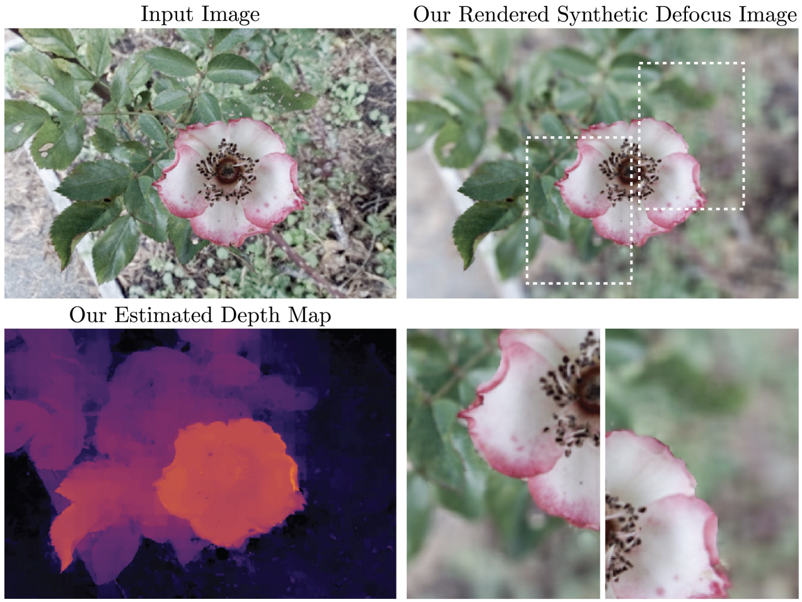

+++
title = "Aperture Supervision for Monocular Depth Estimation"
date = 2018-06-01T00:00:00
draft = false

# Authors. Comma separated list, e.g. `["Bob Smith", "David Jones"]`.
authors = ["Pratul P. Srinivasan", "Rahul Garg", "Neal Wadhwa", "Ren Ng", "Jonathan T. Barron"]

# Publication type.
# Legend:
# 0 = Uncategorized
# 1 = Conference paper
# 2 = Journal article
# 3 = Manuscript
# 4 = Report
# 5 = Book
# 6 = Book section
# 7 = Thesis
# 8 = Patent
publication_types = ["1"]

# Publication name and optional abbreviated version.
publication = "In *Conference on Computer Vision and Pattern Recognition (CVPR)*."
publication_short = "In *CVPR*"

# Abstract and optional shortened version.
abstract = "We present a novel method to train machine learning algorithms to estimate scene depths from a single image, by using the information provided by a camera’s aperture as supervision. Prior works use a depth sensor’s outputs or images of the same scene from alternate viewpoints as supervision, while our method instead uses images from the same viewpoint taken with a varying camera aperture. To enable learning algorithms to use aperture effects as supervision, we introduce two differentiable aperture rendering functions that use the input image and predicted depths to simulate the depth-of-field effects caused by real camera apertures. We train a monocular depth estimation network end-to-end to predict the scene depths that best explain these finite aperture images as defocus-blurred renderings of the input all-in-focus image."

# Summary. An optional shortened abstract.
summary = "*CVPR 2018*. Defocus blur provides a supervisory signal for training deep networks to estimate depth from a single all-in-focus image."

# Is this a featured publication? (true/false)
featured = false

# Projects (optional).
#   Associate this publication with one or more of your projects.
#   Simply enter your project's folder or file name without extension.
#   E.g. `projects = ["deep-learning"]` references 
#   `content/project/deep-learning/index.md`.
#   Otherwise, set `projects = []`.
projects = []

# Tags (optional).
#   Set `tags = []` for no tags, or use the form `tags = ["A Tag", "Another Tag"]` for one or more tags.
tags = []

# Links (optional).
# url_pdf = "https://people.eecs.berkeley.edu/~pratul/CVPR17_LF_BLIND_MOTION_DEBLURRING.pdf"
# url_preprint = "http://eprints.soton.ac.uk/352095/1/Cushen-IMV2013.pdf"
url_code = "https://github.com/google/aperture_supervision"
# url_dataset = "https://people.eecs.berkeley.edu/~pratul/deblur_data_results.zip"
# url_project = "#"
# url_slides = "#"
# url_video = "https://youtu.be/rtukre-ErmI"
# url_poster = "#"
# url_source = "#"

# Custom links (optional).
#   Uncomment line below to enable. For multiple links, use the form `[{...}, {...}, {...}]`.
links = [{name = "Paper on Arxiv", url = "https://arxiv.org/abs/1711.07933"}]

# Digital Object Identifier (DOI)
doi = ""

# Does this page contain LaTeX math? (true/false)
math = true

# Featured image
# To use, add an image named `featured.jpg/png` to your page's folder. 
[image]
  # Caption (optional)
  # caption = "Image credit: [**Unsplash**](https://unsplash.com/photos/pLCdAaMFLTE)"

  # Focal point (optional)
  # Options: Smart, Center, TopLeft, Top, TopRight, Left, Right, BottomLeft, Bottom, BottomRight
  focal_point = "Center"
  preview_only = true
+++

## Example Result

