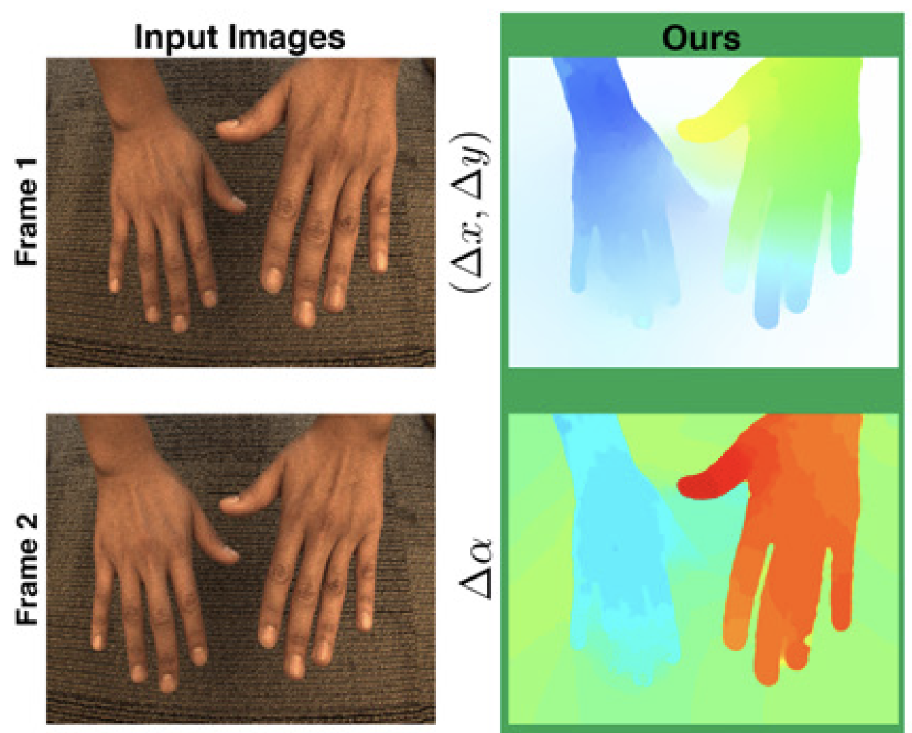

+++
title = "Oriented Light-Field Windows for Scene Flow"
date = 2015-12-01T00:00:00
draft = false

# Authors. Comma separated list, e.g. `["Bob Smith", "David Jones"]`.
authors = ["Pratul P. Srinivasan", "Michael W. Tao", "Ren Ng", "Ravi Ramamoorthi"]

# Publication type.
# Legend:
# 0 = Uncategorized
# 1 = Conference paper
# 2 = Journal article
# 3 = Manuscript
# 4 = Report
# 5 = Book
# 6 = Book section
# 7 = Thesis
# 8 = Patent
publication_types = ["1"]

# Publication name and optional abbreviated version.
publication = "In *International Conference on Computer Vision (ICCV)*."
publication_short = "In *ICCV*"

# Abstract and optional shortened version.
abstract = "2D spatial image windows are used for comparing pixel values in computer vision applications such as correspondence for optical flow and 3D reconstruction, bilateral filtering, and image segmentation. However, pixel window comparisons can suffer from varying defocus blur and perspective at different depths, and can also lead to a loss of precision. In this paper, we leverage the recent use of light-field cameras to propose alternative oriented lightfield windows that enable more robust and accurate pixel comparisons. For Lambertian surfaces focused to the correct depth, the 2D distribution of angular rays from a pixel remains consistent. We build on this idea to develop an oriented 4D light-field window that accounts for shearing (depth), translation (matching), and windowing. Our main application is to scene flow, a generalization of optical flow to the 3D vector field describing the motion of each point in the scene. We show significant benefits of oriented lightfield windows over standard 2D spatial windows. We also demonstrate additional applications of oriented light-field windows for bilateral filtering and image segmentation."

# Summary. An optional shortened abstract.
summary = "In *ICCV 2015*. 4D light field descriptors to compute better dense scene flow."

# Is this a featured publication? (true/false)
featured = false

# Projects (optional).
#   Associate this publication with one or more of your projects.
#   Simply enter your project's folder or file name without extension.
#   E.g. `projects = ["deep-learning"]` references 
#   `content/project/deep-learning/index.md`.
#   Otherwise, set `projects = []`.
projects = []

# Tags (optional).
#   Set `tags = []` for no tags, or use the form `tags = ["A Tag", "Another Tag"]` for one or more tags.
tags = []

# Links (optional).
url_pdf = "https://cseweb.ucsd.edu/~ravir/lfsceneflow.pdf"
# url_preprint = "http://eprints.soton.ac.uk/352095/1/Cushen-IMV2013.pdf"
url_code = "https://people.eecs.berkeley.edu/~pratul/ICCV15_LF_SCENE_FLOW.zip"
# url_dataset = "http://people.duke.edu/~sf59/Srinivasan_BOE_2014_dataset.htm"
# url_project = "#"
# url_slides = "#"
url_video = "https://youtu.be/hENxM4lBVXo"
# url_poster = "#"
# url_source = "#"

# Custom links (optional).
#   Uncomment line below to enable. For multiple links, use the form `[{...}, {...}, {...}]`.
# links = [{name = "Journal Link", url = "https://ieeexplore.ieee.org/document/7452621"}, {name = "Journal Article PDF", url = "https://cseweb.ucsd.edu/~ravir/normals_PAMI.pdf"}, {name = "Conference Paper PDF", url = "https://www.cv-foundation.org/openaccess/content_cvpr_2015/papers/Tao_Depth_From_Shading_2015_CVPR_paper.pdf"}]

# Digital Object Identifier (DOI)
doi = ""

# Does this page contain LaTeX math? (true/false)
math = true

# Featured image
# To use, add an image named `featured.jpg/png` to your page's folder. 
[image]
  preview_only = true
  # Caption (optional)
  # caption = "Image credit: [**Unsplash**](https://unsplash.com/photos/pLCdAaMFLTE)"

  # Focal point (optional)
  # Options: Smart, Center, TopLeft, Top, TopRight, Left, Right, BottomLeft, Bottom, BottomRight
  preview_only = true
  focal_point = "Center"
+++

# Results Video
<iframe width="560" height="315" src="https://www.youtube.com/embed/hENxM4lBVXo" frameborder="0" allow="accelerometer; autoplay; encrypted-media; gyroscope; picture-in-picture" allowfullscreen></iframe>

testing another image: 
